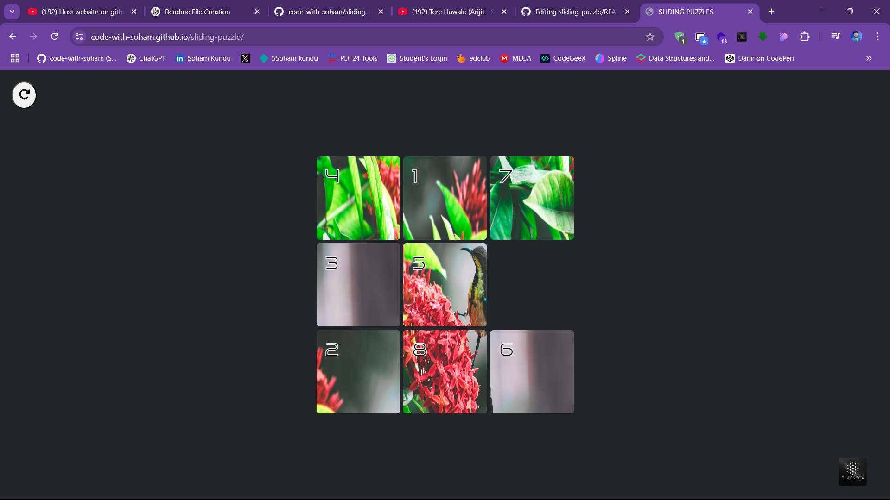

# Sliding Puzzle Game

Welcome to the **Sliding Puzzle Game**! This interactive web-based puzzle game challenges users to arrange scrambled tiles into their correct order.

## 🚀 Live Demo
Check out the live version of the project here: [Sliding Puzzle Game](https://code-with-soham.github.io/sliding-puzzle/)

## 📌 Features
- 🎮 **Interactive Gameplay** – Drag tiles to solve the puzzle.
- 🖼️ **Customizable Images** – Play with different puzzle images.
- ⏱️ **Timer & Move Counter** – Track your performance.
- 📱 **Responsive Design** – Works on desktops, tablets, and mobile devices.
- ⚡ **Smooth Animations** – Enjoy fluid tile movements.

## 🛠️ Technologies Used
- **HTML5, CSS3, JavaScript** – Core web technologies.
- **Canvas API** – For rendering the puzzle.
- **Event Listeners** – For user interactions.

## 📥 Installation & Usage
1. Clone the repository:
   ```bash
   git clone https://github.com/code-with-soham/sliding-puzzle.git
   ```
2. Navigate to the project directory:
   ```bash
   cd sliding-puzzle
   ```
3. Open `index.html` in a browser or use a local server:
   ```bash
   live-server
   ```

## 📸 Screenshots
*
*

## 📌 Future Enhancements
- 🎵 Add sound effects.
- 🔢 Increase difficulty levels.
- 🏆 Add a leaderboard for best scores.

## 🤝 Contributing
Feel free to fork this repository, raise issues, or contribute improvements. Contributions are always welcome!

## 📜 License
This project is licensed under the MIT License.

## 📬 Contact
For any queries, reach out to me:
- 🔗 [GitHub](https://github.com/code-with-soham)
- 📧 Email: (your email here)

---

Enjoy solving the puzzle! 🧩🚀


